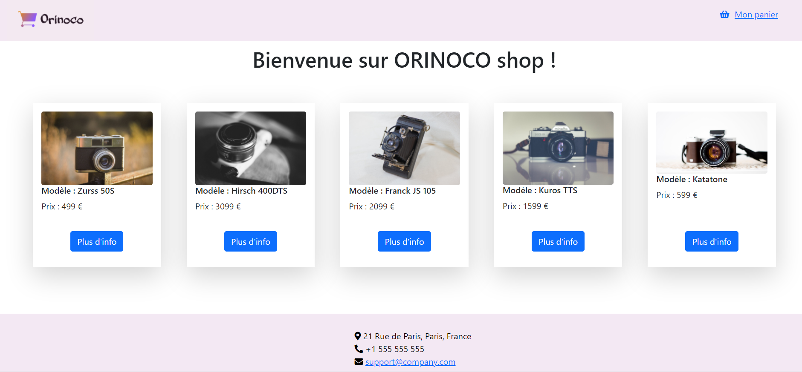

# ORINOCO #
Cinquième projet du parcours développeur web chez OpenClassrooms.
L'objectif principal consiste à la création du front-end d'un site e-commerce en Javascript par la consommation d'un API préalablement fourni ( JWDP5 ).
Il ne s'agit là que d'un MVP, aucune réelle gestion des transaction n'est effectué.
Il est demandé d'improviser l'interface utilisateur. Le disign du l’application est aux choix.

## Cahier des charges ##
#### Todo
- Vérifier que les inputs sont corrects avant l'envoi au back-end
- Effectuer un plan de test

#### Général
- Création d'une page présentant tous les produits
- Création d'une page présentant les détails d'un produit et la possibilité de l'ajouter au panier
- Création d'une page panier contenant la liste des produits présents ainsi qu'un formulaire pour effectuer l'achat
- Création d'une page de remerciement après achat
- Les pages devront être créés en HTML, CSS (frameworks de votre choix acceptés) et vanilla javascript (sans framework)

#### Qualité de code
- Le code devra être indenté
- Le code devra contenir des commentaires
- Le code devra contenir des commentaires
- Le code devra être accompagné d'un document planifiant des éventuelles test unitaires

#### Expérience utilisateur
- Les inputs du formulaire d'achat devront être validés avant l'envoi à l'API

## Tester le site en local ##
#### Prérequis
- Node.js (version 14.15.1 LTS utilisée durant le développement)
- NPM (version 6.14.8 utilisée durant le développement)

#### Installation
`npm install`

#### Lancement du serveur
`npm install`
Le serveur se lance sur localhost avec le port par default 3000.

#### Lancement de l'application
Ouvrez simplement le fichier index.html, aucun serveur n'est requis. Pour le développement, il est conseillé d'utiliser l'extension "Live Server" de Visual Studio Code.

## Documentation ##
Pour en savoir plus, veuillez consulter le document [ici](https://s3-eu-west-1.amazonaws.com/course.oc-static.com/projects/DWJ_FR_P5/P5_Spe%CC%81cifications%20fonctionnelles%20Orinoco%20(2).pdf) .
